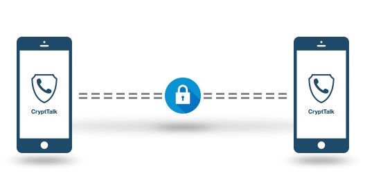
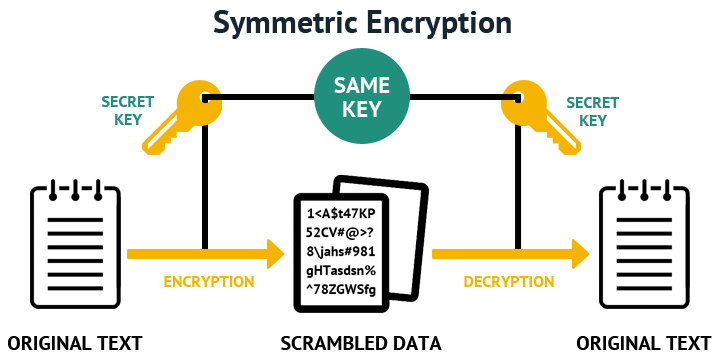
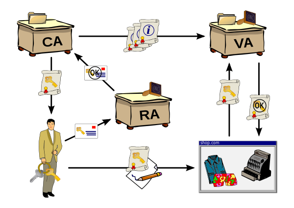
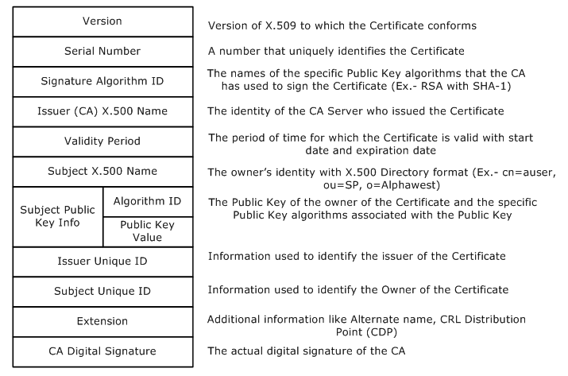
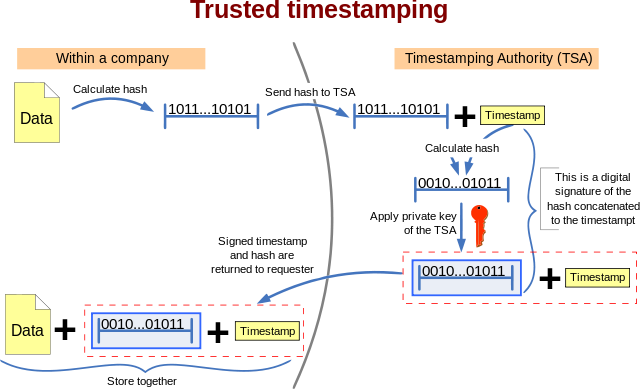

title: X-RAY 509 Tools
class: animation-fade
layout: true

<!-- This slide will serve as the base layout for all your slides -->
.bottom-bar[
  {{title}}
]


---

class: impact

# {{title}}
## Lo que los certificados X.509 esconden :)

David Castañón

Para ImagineCode 2019. Patrocinado por Espublico Tecnología


      


---

class: impact
# El origen de los certificados digitales

---
# Necesidad

Deseamos un intercambio de información de forma segura entre personas o sistemas



---
## Soluciones

Usar criptografía de clave simétrica



---
## Desventajas

- Tenemos que ponernos de acuerdo sobre que clave vamos a usar para intercambiar mensajes y además
- La clave es conocida por todos los participantes

---
## Más soluciones

Usar criptografía de clave asimétrica ó pública ó de dos claves

Cada persona tiene dos claves
- La pública se puede entregar a cualquier persona
- La privada a la que nadie tiene acceso

---
## Características de la criptografía de dos claves

- Dos personas no pueden generar las mismas claves
- Un mensaje cifrado con una de las claves sólo se puede descifrar con la otra
- Si cifro un mensaje con la privada, todo el que tenga la pública podrá descrifrarlo.
- Sólo la persona que tenga el control de la clave privada podrá haber cifrado el mensaje.

---
## Cifrado de un mensaje
- Si cifro un mensaje con una clave pública nadie excepto el poseedor de la clave privada puede descrifrarlo
--

1. Ana redacta un mensaje.
1. Ana cifra el mensaje con la clave pública de David.
1. Ana envía el mensaje cifrado a David a través de internet, ya sea por correo electrónico, mensajería instantánea o cualquier otro medio.
1. David recibe el mensaje cifrado y lo descifra con su clave privada.
1. David ya puede leer el mensaje original que le mandó Ana.
---
## Firma digital
- Si sabemos qué persona es dueña la privada podemos identificarlo como autor del mensaje cifrado

--


1. David redacta un mensaje.
1. David firma digitalmente el mensaje con su clave privada.
1. David envía el mensaje firmado digitalmente a Ana a través de internet, ya sea por correo electrónico, mensajería instantánea o cualquier otro medio.
1. Ana recibe el mensaje firmado digitalmente y comprueba su autenticidad usando la clave pública de David.
1. Ana ya puede leer el mensaje con total seguridad de que ha sido David el remitente.

Source: [Wikipedia](https://es.wikipedia.org/wiki/Criptograf%C3%ADa_asim%C3%A9trica)
---
# ¿Cómo sabemos que la clave pública pertenece a una determinada persona?
--

## Por la confianza
--

Hay muchos mecanismos, algunos de ellos:

- Estableciendo una red de confianza: PGP
- Entidades con autoridad aseguran la vinculación entre claves e identidades: PKI

---
# Infraestructura de clave pública o PKI
Es una infraestructura para asegurar que unas claves pertenecen a una persona o entidad


---
# Componentes fundamentales de una PKI
- La autoridad de registro (RA) es la responsable de verificar el enlace entre la clave pública del certificado, la privada y la identidad del titular.
--

- Una autoridad de certificación (CA) en la que confiamos firma un documento que vincula unas claves con una identidad, este documento es un certificado y el proceso es el de emisión del certificado.
--

- La CA también puede decir que un certificado ya no es válido, esto es revocar el certificado.
--

- La autoridad de validación (VA): es la encargada de dar información sobre la validez de los certificados digitales.
--

- El repositorio de certificados y el repositorio de listas de revocación de certificados (CRL, OCSP)
--

- La autoridad de sellado de tiempo (TSA): es la encargada de firmar documentos con la finalidad de probar que existían antes de un determinado instante de tiempo.


Source: [Wikipedia](https://es.wikipedia.org/wiki/Infraestructura_de_clave_p%C3%BAblica)
---
## Seguridad de la PKI
- La seguridad en la infraestructura PKI depende en parte de cómo se guarden las claves privadas
--

- ¿Por qué nos fiamos de una autoridad de certificación?

--

Por los procedimientos operacionales o Políticas de seguridad aplicados (DPC)

---
## X509

En criptografía, X.509 es un estándar UIT-T para infraestructuras de claves públicas

P.e. define los formatos estándar para certificados

Su sintaxis se define empleando el lenguaje ASN.1 (Abstract Syntax Notation One)

Source: [Wikipedia](https://es.wikipedia.org/wiki/X.509)

---
## X509 - Codificación
- ASN.1 permite definir estructuras de datos, son los esquemas o interfaces de datos
- ASN.1 se puede codificar de muchas formas: BER, DER, XER, JER, PER, OER

Más info: [A Layman's Guide to a Subset of ASN.1, BER, and DER](http://luca.ntop.org/Teaching/Appunti/asn1.html)

https://www.oss.com/asn1/resources/reference/asn1-reference-card.html
---
## Reglas básicas


###Tipos básicos

BOOLEAN, INTEGER, BIT STRING, OCTET STRING, OBJECT IDENTIFIER, SEQUENCE OF, SET OF, CHOICE...

###Codificación DER

TLV - Tag, Length, Value


http://www.oss.com/asn1/resources/books-whitepapers-pubs/asn1-books.html
http://luca.ntop.org/Teaching/Appunti/asn1.html

---
## Ejemplo de Codificación
ASN.1:
```
Contact ::= SEQUENCE {
name VisibleString,
phone NumericString
}
```
Basic Encoding Rules (BER)
```
       30 19  80 0A 4A6F686E20536D697468  81 0B 3938372036353433323130
```
JSON Encoding Rules (JER)  
```
       { "name" : "John Smith", "phone" : "987 6543210" }
```

Source: http://www.oss.com/asn1/resources/asn1-made-simple/introduction.html
---
## X509 - OID

Un nodo en un espacio de nombres asignados jerárquicamente

1.3.6.1.4.1.343

* 1 ISO
* 1.3 identified-organization,
* 1.3.6 dod,
* 1.3.6.1 internet,
* 1.3.6.1.4 private,
* 1.3.6.1.4.1 IANA enterprise numbers,
* 1.3.6.1.4.1.343 Intel Corporation


http://www.oid-info.com/

https://es.wikipedia.org/wiki/Identificador_de_objeto

---
## X509 - Estructura de un certificado
ASN.1 (RFC 5280):
```
Certificate  ::=  SEQUENCE  {
     tbsCertificate       TBSCertificate,
     signatureAlgorithm   AlgorithmIdentifier,
     signatureValue       BIT STRING  }

TBSCertificate  ::=  SEQUENCE  {
     version         [0]  EXPLICIT Version DEFAULT v1,
     serialNumber         CertificateSerialNumber,
     signature            AlgorithmIdentifier,
     issuer               Name,
     validity             Validity,
     subject              Name,
     subjectPublicKeyInfo SubjectPublicKeyInfo,
     issuerUniqueID  [1]  IMPLICIT UniqueIdentifier OPTIONAL,
                          -- If present, version MUST be v2 or v3
     subjectUniqueID [2]  IMPLICIT UniqueIdentifier OPTIONAL,
                          -- If present, version MUST be v2 or v3
     extensions      [3]  EXPLICIT Extensions OPTIONAL
                          -- If present, version MUST be v3
     }
```
---
## X509 - Estructura de un certificado
Graficamente:

---
class: impact
# X-RAY 509

# La herramienta
---
# Aspectos generales

Es un visor de certificados X.509 y se complementa con un visualizador de ocsp y timestamps

Github: https://github.com/antik10ud/xray509


- Java
- No dependencias
- Human-centric
- usability-over-speed

---
# Herramientas
The following tools are currently provided but in progress:
* [XRAY-Cert](doc/xray-cert.md)  View and query certificates
* [XRAY-OCSP](doc/xray-ocsp.md) Check the online status of a certificate
* [XRAY-OSQ](doc/xray-osq.md) Dump RFC 6960 OCSP Request
* [XRAY-CRL](doc/xray-crl.md) View certificate revocation lists
* [XRAY-TS](doc/xray-ts.md) Generation of time stamps
* [XRAY-TSR](doc/xray-tsr.md) Dump RFC 3161 Timestamp Response
* [XRAY-TSQ](doc/xray-tsq.md) Dump RFC 3161 Timestamp Query
* [XRAY-TS-Check](doc/xray-ts-chk.md) Time stamp verification

---
# xray-cert
Visualizar contenido de un certificado
```
openssl x509 -in google.pem -text -noout
```
```
xray-cert --help
xray-cert tls:https://google.com
```

Sources:

- pem/der/cer/crt/base64
- data:_data_
- tls:_https-url_

---
# xray-cert extensiones
Extensiones soportadas en xray-cert:


AIAProc
AttrProc
AuthorityKeyIdentifierProc
BaseExtensionProc
BasicConstraintsProc
BiometricInfoProc
CabfOrganizationIdentifierProc
CertificateTransparencyProc
CRLCertificateIssuerProc
CRLDistPointsProc
CRLInvalidityDateProc
CRLNumberProc
CRLReasonCodeProc
DefaultProc
EntrustVersInfoProc
ExpiredCertsOnCRLProc
ExtKeyUsageProc
Flags
IssuerAltNameProc
KeyUsageProc
NameConstraintsProc
NetscapeCertUsageProc
PersonalDataInfoProc
PolicyProc
PrivateKeyUsagePeriodProc
QCStatementProc
SubjectAltNameProc
SubjectDirAttrProc
SubjectKeyIdentifierProc

---
# xray-cert como conversor
```
xray-cert -f pem tls:https://www.google.com > /tmp/c.pem
```

Formatos soportados:

* text - Text output.
* json - JSON output.
* keys - KV output.
* csv - Comma Separated Values output.
* der - DER output (i.e. crt, cer)
* pem - PEM output.


---

# xray-ocsp
```
openssl ocsp -issuer chain.pem -cert wikipedia.pem -text -url http://ocsp.digicert.com
```

```
xray-ocsp tls:https://wikipedia.org
```

- Dertermina el certificado del emisor analizando el propio certificados (AIA)
- Permite verificar el servicio de ocsp probando la petición GET


---
# xray-crl

```
xray-crl tls:https://www.microsoft.com
```
---
# xray-ts



Source: [Wikipedia](https://es.wikipedia.org/wiki/X.509)
---
# xray-ts - Sello de tiempo

- Unos datos han existido y no han sido alterados desde un instante específico en el tiempo
- RFC 3161


```
xray-ts --source-text "carpe diem" -o ts  http://tsa.belgium.be/connect
```

Otra TSA:

```
xray-ts --source-text "carpe diem" -o ts  http://tsa.safestamper.com

```
--

¿Por qué confiamos en una TSA?

---
# xray-cert para filtar o buscar certificados

```
$ xray-cert --query "MATCH Extensions/**/$qcType:=0.4.0.1862.1.6 RETURN $qcType" eidas.pem
```

```
$ cat q
MATCH
  $sn:=SerialNumber,
  Subject/*/$cn:=2.5.4.3
RETURN
  $sn{hex},
  $cn{}

$ xray-cert -f csv --query @q @allcerts.list

```


---

class: impact
## Gracias por vuestra atención
